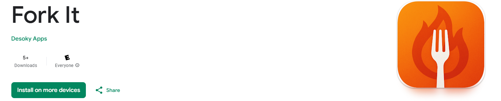

# Fork It

**Fork It** is a collaborative Android app that helps groups of friends decide where to eat — no more endless group chats or indecisiveness. It considers everyone's dietary restrictions and cuisine preferences, then recommends nearby restaurants and lets users vote in real time to find the perfect spot.

#### Download on the App Store: [Fork It](https://play.google.com/store/apps/details?id=com.team03.forkit&hl=en)
---

## Features

- 🧑‍🤝‍🧑 Create sessions and invite friends with a unique code
- 📍 Personalized restaurant recommendations using **Google Places API**
- 🥗 Supports **dietary restrictions** (Halal, Vegan, Gluten-Free, etc.)
- 🍣 Filters by **cuisine type**, **meal type**, **price**, and **hours**
- 🗳️ **Swipe-to-vote** interface with automatic group consensus
- 🕒 View **past restaurants** from previous sessions
- 🌗 Supports **dark mode** and is responsive across devices
- ⚡ Real-time updates via **Firebase Firestore** and **Pub-Sub architecture**

---

## Tech Stack
**Built With:**
* [![Android][Android]][Android-url]
* [![Kotlin][Kotlin]][Kotlin-url]
* [![Firebase][Firebase]][Firebase-url]
* [![GCP][GCP]][GCP-url]
- **Architecture:** MVVM, StateFlow, LiveData  
- **Design Patterns:** Observer, Template Method, Publish-Subscribe
---

## How It Works

1. Sign in and set your dietary preferences  
2. Start a session and invite your friends  
3. Everyone selects their preferred cuisine types  
4. Fork It recommends 50+ restaurants based on collective preferences using a custom **weighted scoring algorithm** (e.g., Halal > Italian)  
5. Users swipe to vote, and Fork It finalizes the group's top choice  
6. Past winning restaurants are saved to your profile  

---

## Screenshots

>

---

<!-- MARKDOWN LINKS & IMAGES -->
<!-- https://www.markdownguide.org/basic-syntax/#reference-style-links -->
[Kotlin]: https://img.shields.io/badge/Kotlin-purple?style=for-the-badge&logo=kotlin
[Kotlin-url]: https://kotlinlang.org/
[Android]: https://img.shields.io/badge/Android-green?style=for-the-badge&logo=android
[Android-url]: https://developer.android.com/
[Firebase]: https://img.shields.io/badge/Firebase-orange?style=for-the-badge&logo=firebase
[Firebase-url]: https://firebase.google.com/
[GCP]: https://img.shields.io/badge/GCP-white?style=for-the-badge&logo=google-cloud
[GCP-url]: https://cloud.google.com/?hl=en
